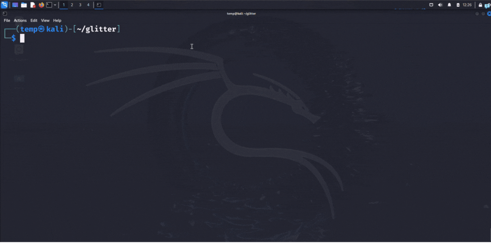

# Glitter ✨
An Automated IOC Extraction, Validation & YARA Rule Generation Tool for Malware Analysis & Threat Detection

## Overview
Glitter extracts IOCs (IPs, URLs) from binary and text files, validates them using VirusTotal, and generates custom YARA rules for detection based on the results.

## Features:
- **IOC Extraction**: Extracts IPs and URLs from both binary and text files.
- **VirusTotal Validation**: Validates extracted IOCs using VirusTotal for immediate threat intelligence.
- **YARA Rule Generation**: Automatically generates custom YARA rules based on detected IOCs for further analysis.
- **Configurable Detection Thresholds**: Adjust detection sensitivity via the `conf.json` configuration file.
- **Cross-Platform Support**: Works seamlessly on Windows, macOS, and Linux.
- **Sleek Output**: Provides clear and organized output with an optional custom ASCII banner for added flair.

## Demo


## Installation

### Prerequisites:
- Python 3.6 or higher
- pip (Python package installer)
- VirusTotal API key (required for IOC validation)

### Steps:

1. Clone the repository:
    ```bash
    git clone https://github.com/nouranabdlsalam/glitter.git
    ```

2. Navigate to the project directory:
    ```bash
    cd glitter
    ```

3. Install the required dependencies:
    ```bash
    pip install -r requirements.txt
    ```

4. Sign up for a [VirusTotal API key](https://www.virustotal.com/gui/my-apikey) (free tier should be sufficient).

5. Copy the example configuration file and update it with your VirusTotal API key:
    ```bash
    cp conf.example.json conf.json
    ```
    Then open `conf.json` and paste your API key into the appropriate field:
    ```json
    {
        "api-key": "your-api-key-here"
    }
    ```

6. Run Glitter:
    ```bash
    python glitter.py -p [path(s)/to/file(s)/or/directories(s)]
    ```

That’s it! You’re ready to start extracting IOCs and generating YARA rules.

## **Usage**

After installing Glitter, you can use it from the command line with various options to customize your scan.

```bash
python glitter.py -p path/to/file/or/directory [options]
```

### Options:
- `-p`, `--path`: **Required**. Path(s) to the file(s) or directory you want to scan. You can specify multiple paths by separating them with spaces.
   ```bash
  python glitter.py -p /path/to/file1 /path/to/file2 /path/to/directory
  ```
  
- `-o`, `--output`: **Optional**. Specify the folder where output files will be saved. By default, this will be the outputs/ folder in the glitter directory.
   ```bash
  python glitter.py -p /path/to/file -o /path/to/output/folder
  ```
  
- `--no-yara`: **Optional**. Disable YARA rule generation. If you just want to extract and validate IOCs without creating YARA rules, use this flag.
   ```bash
  python glitter.py -p /path/to/file --no-yara
   ```
  
- `-q`, `--quiet-mode`: **Optional**. Run Glitter without displaying the banner. Use this for a more minimal output.
   ```bash
  python glitter.py -p /path/to/file -q
  ```
  
- `-r`, `--recursive`: **Optional**. Recursively scan subdirectories for files.
   ```bash
  python glitter.py -p /path/to/directory -r
   ```
  
- `-v`, `--verbose`: **Optional**. Show detailed scanning information, including all scanned IOCs.
   ```bash
  python glitter.py -p /path/to/file -v
   ```
  
- `-h`, `--help`: **Optional**. Display the help message with all available options and exit.
   ```bash
   python glitter.py -h
  ```
  
### Examples:
To scan a file and generate output with YARA rules in a specific output folder:
```bash
python glitter.py -p /path/to/malicious_file -o /path/to/output/folder
```

To scan a directory recursively and disable YARA rule generation:
```bash
python glitter.py -p /path/to/directory -r --no-yara
```

## Limitations & Scope
Glitter performs **static IOC extraction** using regex-based detection. It works best on:
- Plaintext files containing threat indicators
- Malware samples that are not obfuscated or packed
- Logs, reports, or sandbox outputs

**Important**: If malware samples use encryption, compression, dynamic C2 generation, or packing techniques, Glitter may not detect any IOCs. These techniques are common in real-world malware to evade basic static analysis. Glitter is intentionally lightweight and does not perform dynamic analysis, decryption, or unpacking.

This tool is ideal as a **first-pass triage tool** or part of a broader threat hunting pipeline.

## **Contact**
Feel free to reach out to me via LinkedIn: [Nouran Abdelsalam](https://www.linkedin.com/in/nouranabdelsalam/)